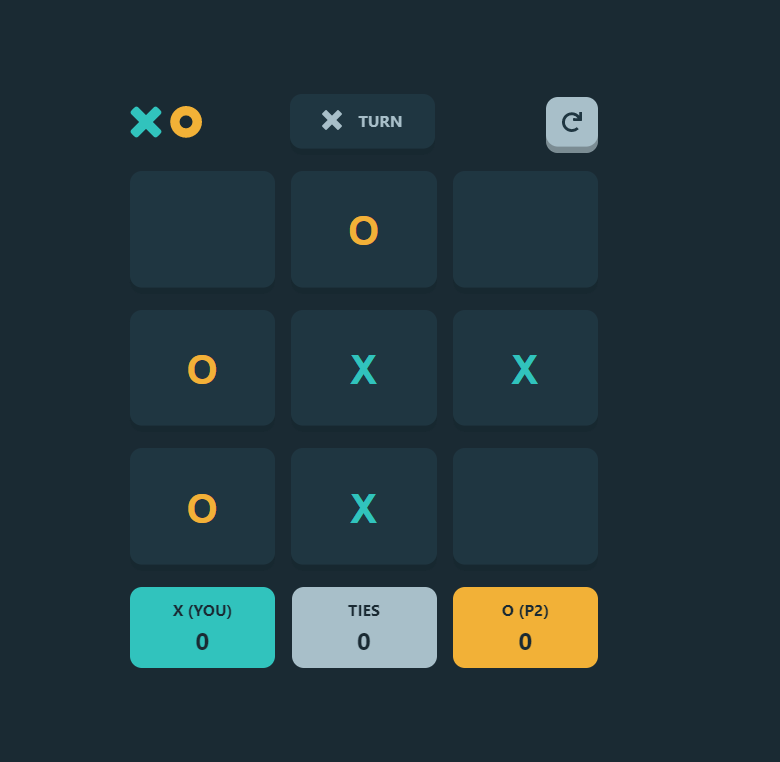

# FrontEnd Mentor Challange

This is a solution to the [Tic Tac Toe challenge on Frontend Mentor](https://www.frontendmentor.io/challenges/tic-tac-toe-game-Re7ZF_E2v).

### Built with

- Semantic HTML5 markup
- CSS
- Flexbox
- CSS Grid
- Desktop-first workflow
- [React](https://reactjs.org/) - JS library
- [Framer motion](https://www.framer.com/motion/) - For animation

### Links

- Solution URL: [Add solution URL here](https://github.com/Blaumanis/Tic-Tac-Toe)
- Live Site URL: [Add live site URL here](https://tic-tac-toe-blauman.netlify.app/)

### Screenshot

